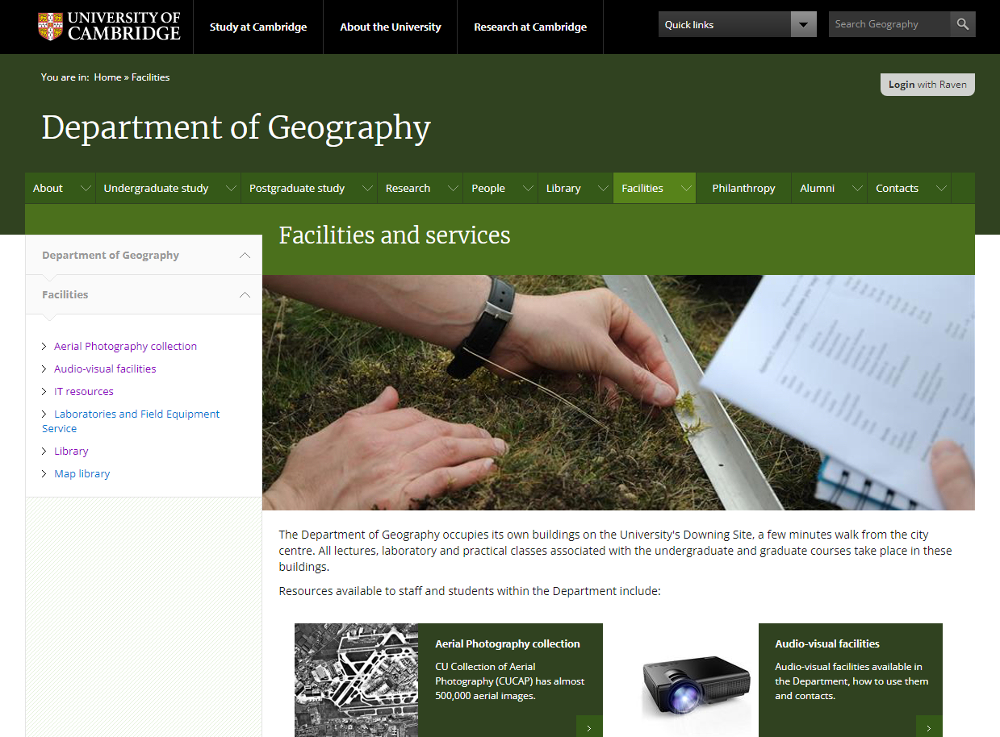

Project Light - pureContent implementation
==========================================

This is an implementation of the University of Cambridge's 'Project Light' house style in pureContent.

Screenshot
----------

Usage
-----

1. Clone the repository.
2. Download the library dependencies and ensure they are in your PHP include_path.
3. Add the Apache directives in httpd.conf (and restart the webserver) as per the example given in .httpd.conf.extract.txt; the example assumes mod_macro but this can be easily removed.
4. Copy the example config file to /sitetech/.config.php and fill in the details.
5. Access the page in a browser at a URL which is served by the webserver.

Dependencies
------------

* [pureContent.php general environment library](https://download.geog.cam.ac.uk/projects/purecontent/)

Example sites
-------------

* www.spri.cam.ac.uk
* www.esg.cam.ac.uk
* www.campop.geog.cam.ac.uk
* www.ccru.geog.cam.ac.uk
* www.bbce.uk
* Geography Intranet

Author
------

Martin Lucas-Smith, Department of Geography, University of Cambridge, 2014-24.

License
-------

GPL3.

